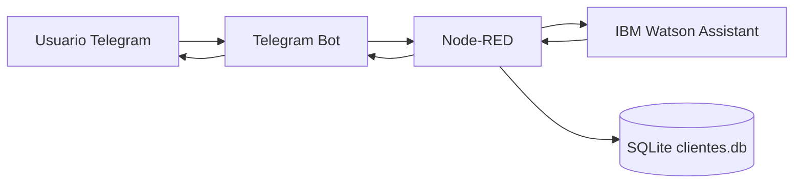

# Lyvia Chatbot Telegram + Node-RED + Watson + SQLite

Projeto inicial para um chatbot que recebe mensagens pelo Telegram, orquestra a conversa no Node-RED, chama o IBM Watson Assistant e consulta CPF em um banco SQLite.

## Arquitetura inicial



## Fluxo da conversa

1. Usuario envia `/start` ou qualquer mensagem ao bot.
2. Node-RED encaminha a mensagem ao Watson Assistant.
3. Watson responde algo como: `Em que posso ajudar`.
4. Node-RED pede o CPF.
5. Usuario informa o CPF.
6. Node-RED valida e normaliza o CPF, consulta o SQLite e responde com os dados encontrados.

## Como rodar

1. Copie o arquivo de ambiente:

```bash
cp .env.example .env
```

2. Preencha no `.env`:

```bash
TELEGRAM_BOT_TOKEN=...
WATSON_API_KEY=...
WATSON_ASSISTANT_ID=...
WATSON_SERVICE_URL=...
```

3. Crie o banco SQLite local:

```bash
sqlite3 nodered-data/clientes.db < db/init.sql
```

4. Suba o Node-RED:

```bash
docker compose up --build
```

5. Abra o editor:

```text
http://localhost:1880
```

O fluxo principal já está em `nodered-data/flows.json`.

No primeiro acesso, abra o node de configuracao do Telegram no Node-RED e confirme o token do bot. Alguns nodes de Telegram guardam esse token como credencial interna do Node-RED, mesmo quando a variavel `TELEGRAM_BOT_TOKEN` existe no Docker.

## Watson Assistant

Configure o Assistant para responder `Em que posso ajudar` no primeiro turno. O fluxo chama a API stateless:

```text
POST /v2/assistants/{assistant_id}/message?version=2024-08-25
```

Enquanto as variáveis `WATSON_API_KEY`, `WATSON_ASSISTANT_ID` e `WATSON_SERVICE_URL` não estiverem configuradas, o fluxo usa uma resposta local de bootstrap para permitir testar Telegram e SQLite.

O projeto tambem instala o pacote `node-red-node-watson`, que disponibiliza o node visual `watson-assistant-v2` na paleta do Node-RED. A primeira versao do fluxo usa HTTP direto para manter as credenciais via `.env`; se preferirmos, podemos substituir esse trecho pelo node visual do Watson Assistant v2.

## CPFs de teste

| CPF | Nome | Status | Plano |
| --- | --- | --- | --- |
| 529.982.247-25 | Maria Oliveira | ativo | Premium |
| 111.444.777-35 | Joao da Silva | pendente | Essencial |
| 123.456.789-09 | Ana Souza | bloqueado | Basico |

## Proximos passos sugeridos

- Trocar o SQLite local por banco corporativo quando o contrato estiver definido.
- Persistir estado de conversa por usuario em Redis/PostgreSQL se o volume crescer.
- Adicionar logs estruturados e mascaramento de CPF.
- Criar intents no Watson para saudacao, consulta de CPF e encerramento.
- Configurar webhook do Telegram em producao, em vez de polling.
