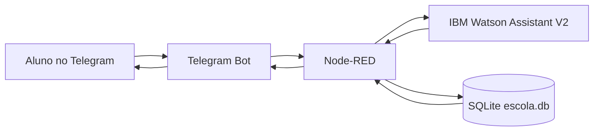

# Visao Geral do Projeto

Este projeto e um chatbot academico integrado ao Telegram, IBM Watson Assistant, Node-RED e SQLite.

O objetivo principal e permitir que um aluno converse pelo Telegram e consulte informacoes academicas como RM, curso, notas, materias inscritas, faltas/presenca e turnos.

## Arquitetura



## Responsabilidade de cada tecnologia

| Tecnologia | Responsabilidade |
| --- | --- |
| Telegram | Interface usada pelo aluno para conversar com o bot. |
| IBM Watson Assistant | Entende a intencao do aluno e controla a conversa. |
| Node-RED | Orquestra integracoes entre Telegram, Watson e SQLite. |
| SQLite | Armazena alunos, cursos, materias, presencas e notas. |
| Docker | Facilita subir o ambiente Node-RED com dependencias. |

## Ideia central do fluxo

1. O aluno envia uma mensagem pelo Telegram.
2. O Node-RED normaliza a mensagem e envia para o Watson Assistant.
3. O Watson interpreta a intencao.
4. Se a resposta for apenas conversacional, o Node-RED devolve a mensagem ao Telegram.
5. Se o Watson pedir uma consulta ao banco, o Node-RED monta uma query SQL.
6. O SQLite retorna os dados.
7. O Node-RED formata uma resposta amigavel para o aluno.

## Contexto do aluno

Depois que o aluno e identificado uma vez, o Node-RED guarda o aluno no contexto da conversa do Telegram.

Por isso, depois de informar CPF ou RM uma vez, o aluno pode perguntar:

```text
minhas notas
minhas faltas
meu curso
meus turnos
```

Sem precisar repetir CPF ou RM.

## Arquivos principais

| Arquivo | Funcao |
| --- | --- |
| `nodered-data/flows.json` | Fluxo completo do Node-RED. |
| `db/init.sql` | Script de criacao e carga inicial do banco. |
| `nodered-data/escola.db` | Banco SQLite usado nos testes. |
| `Dockerfile` | Instala os nodes de Telegram, SQLite e Watson. |
| `docker-compose.yml` | Sobe o Node-RED em container. |
| `README.md` | Instrucoes gerais do projeto. |
