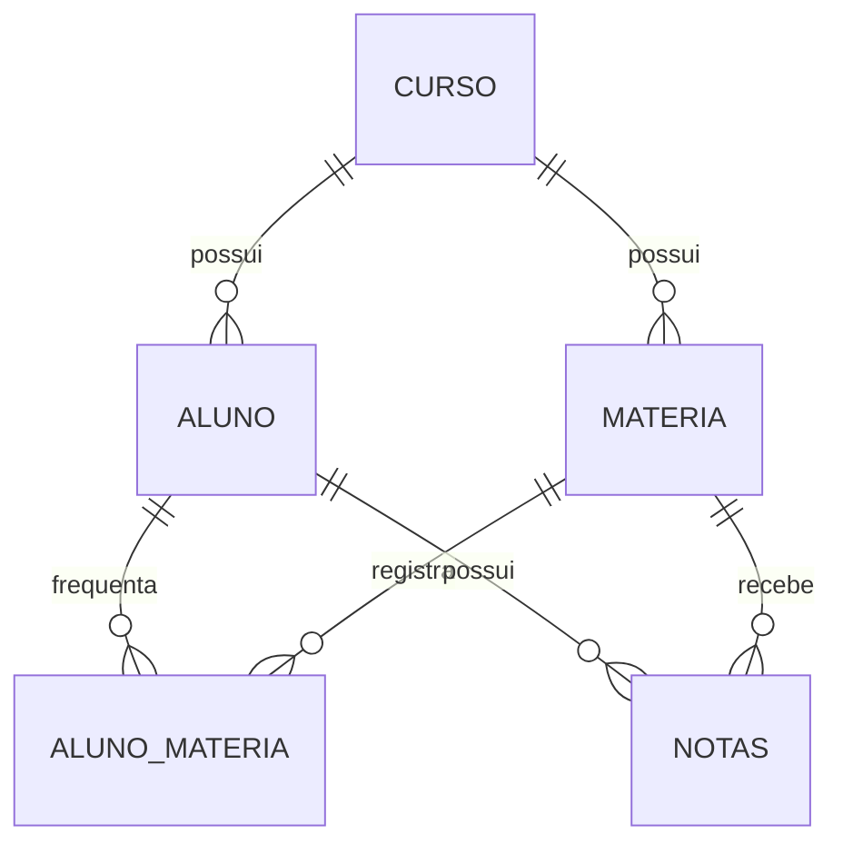

# Banco de Dados SQLite

O banco usado no projeto e `escola.db`.

## Caminho

Dentro do container Node-RED:

```text
/data/escola.db
```

No computador local:

```text
nodered-data/escola.db
```

## Tabelas



## `curso`

Guarda os cursos.

Campos principais:

- `id`: chave primaria.
- `nome`: nome do curso, unico.
- `criado_em`, `atualizado_em`: controle de auditoria.

## `aluno`

Guarda os alunos.

Campos principais:

- `id`: chave primaria.
- `nome`: nome do aluno.
- `cpf`: unico, 11 digitos.
- `rm`: unico.
- `curso_id`: FK para `curso`.

Validacoes:

- CPF precisa ter 11 digitos.
- CPF nao pode conter caracteres nao numericos.
- RM nao pode estar vazio.

## `materia`

Guarda materias vinculadas a cursos.

Campos principais:

- `id`: chave primaria.
- `curso_id`: FK para `curso`.
- `nome`: nome da materia.
- `turno`: manha, tarde, noite ou integral.
- `total_horas`: carga horaria.

Validacoes:

- Turno precisa estar em uma lista permitida.
- Total de horas precisa ser maior que zero.

## `aluno_materia`

Representa presencas/participacao do aluno em materias.

Chave primaria composta:

```text
aluno_id + materia_id + data_presenca
```

Isso permite registrar mais de uma presenca por aluno/materia em datas diferentes.

## `notas`

Guarda notas por aluno e materia.

Chave primaria composta:

```text
aluno_id + materia_id
```

Campos de nota:

- `cp_1`
- `cp_2`
- `gs_1`
- `ch_1`
- `media_final`

`media_final` e uma coluna gerada automaticamente:

```sql
round((cp_1 + cp_2 + gs_1 + ch_1) / 4.0, 2)
```

Validacoes:

- Todas as notas precisam estar entre 0 e 10.

## Indices

O banco possui indices nas FKs para melhorar consultas:

- `idx_aluno_curso_id`
- `idx_materia_curso_id`
- `idx_aluno_materia_materia_id`
- `idx_notas_materia_id`

## Triggers

Cada tabela principal possui trigger para atualizar `atualizado_em` automaticamente quando uma linha muda.
