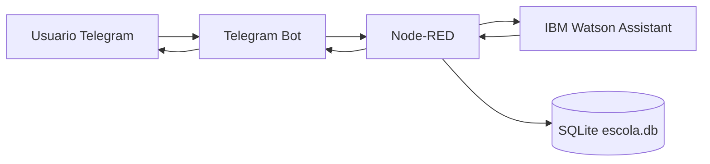

# Lyvia Chatbot Telegram + Node-RED + Watson + SQLite

Projeto inicial para um chatbot que recebe mensagens pelo Telegram, orquestra a conversa no Node-RED, chama o IBM Watson Assistant e consulta CPF em um banco SQLite.

## Arquitetura inicial



## Fluxo da conversa

1. Usuario envia `/start` ou qualquer mensagem ao bot.
2. Node-RED encaminha a mensagem ao Watson Assistant.
3. Watson responde algo como: `Em que posso ajudar`.
4. Node-RED pede o CPF.
5. Usuario informa o CPF.
6. Node-RED valida e normaliza o CPF, consulta o SQLite e responde com os dados encontrados.

## Como rodar

1. Copie o arquivo de ambiente:

```bash
cp .env.example .env
```

2. Preencha no `.env`:

```bash
TELEGRAM_BOT_TOKEN=...
WATSON_API_KEY=...
WATSON_ASSISTANT_ID=...
WATSON_SERVICE_URL=...
```

3. Crie o banco SQLite local:

```bash
sqlite3 nodered-data/escola.db < db/init.sql
```

4. Suba o Node-RED:

```bash
docker compose up --build
```

5. Abra o editor:

```text
http://localhost:1880
```

O fluxo principal já está em `nodered-data/flows.json`.

No primeiro acesso, abra o node de configuracao do Telegram no Node-RED e confirme o token do bot. Alguns nodes de Telegram guardam esse token como credencial interna do Node-RED, mesmo quando a variavel `TELEGRAM_BOT_TOKEN` existe no Docker.

## Watson Assistant V2

O fluxo usa o node visual `assistant V2` do pacote `node-red-node-watson`.

No Node-RED, abra o node **IBM Watson Assistant V2** e configure:

- `API Key`
- `Service Endpoint`
- `Assistant ID`

As interacoes principais devem ser definidas no IBM Cloud Watson Assistant. O Node-RED apenas recebe a acao escolhida pelo Assistant e executa a integracao com SQLite quando necessario.

Contrato esperado no contexto `user_defined` do Watson:

| Variavel | Exemplo | Uso |
| --- | --- | --- |
| `acao_consulta` | `identificar_aluno` | Acao que o Node-RED deve executar |
| `acao_pendente` | `rm` | Acao aguardando CPF/RM quando o Watson pede identificacao |
| `cpf` | `52998224725` | Identificador do aluno |
| `rm` | `RM572956` | Identificador alternativo do aluno |

Acoes suportadas:

- `identificar_aluno`
- `perfil`
- `rm`
- `curso`
- `notas`
- `materias`
- `faltas`
- `turnos`

Exemplo: no primeiro fluxo do Watson, peca o CPF ao aluno. Quando o CPF estiver preenchido, retorne `acao_consulta = identificar_aluno` e `cpf = <cpf informado>`. Depois que o aluno estiver identificado, o Node-RED envia de volta ao Watson, em `additional_context`, dados como `aluno_identificado`, `aluno_id`, `aluno_nome`, `aluno_cpf`, `aluno_rm` e `aluno_curso`.

Depois que o aluno estiver identificado, o Node-RED mantem esse aluno em contexto por conversa do Telegram. Portanto, consultas seguintes como "minhas notas" ou "minhas faltas" nao precisam enviar CPF/RM novamente; o fluxo usa `aluno_id` salvo.

Para fluxos em duas etapas, como "quero consultar meu RM" seguido de CPF, configure o Watson para retornar `acao_pendente = rm` enquanto pede o CPF. Quando o CPF chegar, o Node-RED usa essa acao pendente para executar a consulta mesmo que o Assistant responda uma mensagem generica.

Quando nem o Watson nem o texto do aluno indicam uma acao reconhecida, o bot responde de forma conversacional com uma lista curta de opcoes disponiveis.

O RM pode ser informado como `RM572956` ou apenas `572956`. Quando vier apenas numerico, o bot considera RM somente se houver exatamente 6 digitos. Entradas incompletas como `RM` ou `10` retornam uma mensagem pedindo o numero completo.

## Schema SQLite

O schema em `db/init.sql` segue o modelo da imagem:

- `curso`: cadastro dos cursos.
- `aluno`: cadastro dos alunos, com `cpf` e `rm` unicos.
- `materia`: materias vinculadas ao curso.
- `aluno_materia`: presencas por aluno, materia e data, com chave primaria composta.
- `notas`: notas por aluno e materia, com chave primaria composta por `aluno_id` e `materia_id`.

O banco tambem possui FKs, constraints, indices e timestamps de criacao/atualizacao.

## CPFs de teste

| CPF | Nome | RM | Curso |
| --- | --- | --- | --- |
| 546.924.658-24 | Manuela de Lima Ramos | RM572956 | Analise e Desenvolvimento de Sistemas |
| 604.033.478-90 | Lena Halawi | RM572258 | Analise e Desenvolvimento de Sistemas |
| 549.576.208-81 | Yasmin Souza Silva Martins | RM572102 | Sistemas de Informacao |

## Proximos passos sugeridos

- Trocar o SQLite local por banco corporativo quando o contrato estiver definido.
- Persistir estado de conversa por usuario em Redis/PostgreSQL se o volume crescer.
- Adicionar logs estruturados e mascaramento de CPF.
- Criar intents no Watson para saudacao, consulta de CPF e encerramento.
- Configurar webhook do Telegram em producao, em vez de polling.
